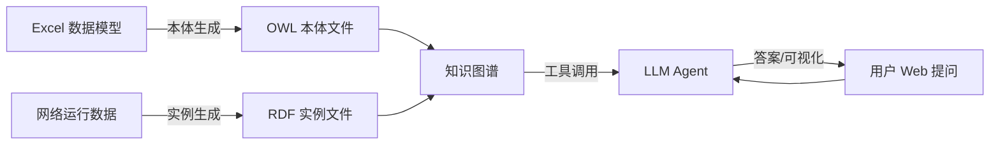

# NbiOntology
Transport Networks Knowledge Graph Based on NBI

## 技术栈
- Python
- `pandas`（读取 Excel）
- `rdflib`（生成 OWL）
- LLM：Ollama本地模型
- SPARQL 查询：rdflib.plugins.sparql 足够小型图谱。
- 可视化：Mermaid 流程图在浏览器端渲染，零依赖。

## 整体架构



- 数据层：Excel 定义资源/性能模型，实例数据按模型组织为 RDF。
- 知识层：本体（TBox）+ 实例（ABox）构成完整知识图谱。
- 分析层：基于 LangChain 的 Agent，封装 SPARQL 查询工具，由 LLM 决策调用。
- 展示层：Streamlit 构建的轻量 Web 界面

## 流水线
Excel实例数据 → 生成RDF实例文件 → 加载图谱 → LLM Agent(SPARQL) → 返回答案

## 项目文件结构

```
Ontology/
├── agents/                       # 本体构建
│   ├── data_loader.py            # OntologyBuilder 类(已有, 需扩展 self.ontology)
│   ├── instances_generator.py    # 实例数据生成
│   ├── llm_agent.py              # LangChain Agent 定义
│   ├── ontology_generator.py     # OntologyBuilder 类(已有, 需扩展 self.ontology)
│   ├── query.py                  # SPARQL 查询、拓扑绘制等工具
│   └── xml_to_csv_batch.py       # 将data文件夹中的资源数据实例xml文件转成csv文件
├── bak/                # 暂存文件, 无需关注
│   ├── …               # 暂存文件, 无需关注
├── data/                               # 数据源文件
│   ├── NbiExampleOtnPerformance.xlsx   # otn北向性能数据模型示例
│   └── NbiExampleOtnResources.xlsx     # otn北向资源模型示例
├── output/                                 # 生成数据
│   ├── otn_ontology_lib.rdf                # 由to_rdf_lib生成的本体文件(xml格式)
│   ├── otn_ontology_script.rdf             # 由to_rdf_script生成的本体文件(xml格式)
│   ├── otn_ontology_test.json              # 由to_json生成的本体文件
│   ├── otn-ontology-ms-example.rdf         # 由microsfot ontology playground手动生成的本体文件, 作为参考样例
│   ├── otn-ontology-Protege-example.owx    # 由Protege手动生成的本体文件, 作为参考样例
│   └── OUTPUT.md                           # 文件夹说明
├── app.py                 # 后续扩展为 Streamlit Web 入口
├── main.py                # 程序入口
└── requirements.txt
```
